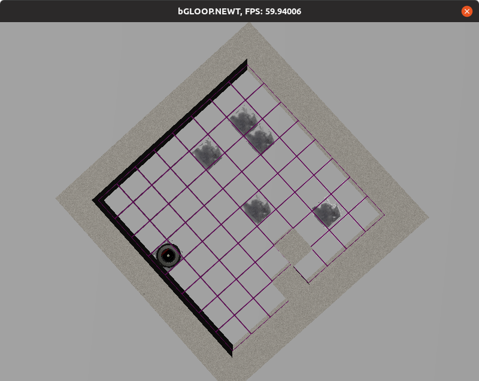

# BlueJ

## Vorbereitung

Installiere die Bibliotheken vom lib Ordner in deinen BlueJ libraries Ordner (siehe [How do I use custom class libraries](https://www.bluej.org/faq.html#faq_How_do_I_use_custom_class_libraries__JARs__)).

## Ausführung

Führe main von MeineWelt aus.

# CLI

## Ausführung

Linux:
```
javac -classpath ".:lib/*" MeineWelt.java
java -classpath ".:lib/*" MeineWelt
```

Windows:
```
javac -classpath ".;lib/*" MeineWelt.java
java -classpath ".;lib/*" MeineWelt
```

